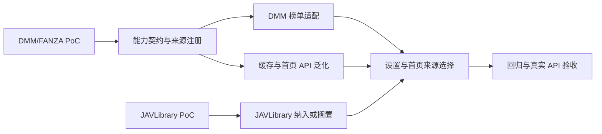

# 多渠道数据源集成方案

## Task Overview

在保留 JavDB 现有榜单能力的前提下，为首页增加可靠的第二榜单来源，并为后续详情渠道接入建立可扩展、可观测、可降级的统一契约。

## Current Analysis

- 当前首页 `/home/ranking` 的缓存刷新可实例化 JavDB 与 JavBus，但实时回退分支只执行 JavDB。
- JavBus 已通过真实首页和详情解析验证，适合详情/下载补全；它没有排行榜实现，不能被当作榜单来源。
- 已有 `DmmSpider`、`Jav321Spider`、`JavbusSpider`、`JavdbSpider`；当前只有 JavDB 提供可消费的排行榜数据。
- JavDB 已证明必须由应用代理和镜像健康探测保障，HTTP 200 本身不足以判定来源可用。

## Solution Design

### 来源路线

1. **DMM/FANZA 排行榜**：首个实施目标。复用 `DmmSpider`，增加其公开榜单解析，形成 JavDB + DMM 双榜单源。
2. **JAVLibrary PoC**：第二优先级。仅在其页面稳定、条款允许且能提供有效元数据/排行时，新增独立 `JavLibrarySpider`。
3. **JavBus**：维持详情、预览和资源补全能力，不进入榜单选择器。
4. **MGStage、FC2、官方无码站**：仅列入候选池；先验证来源条款、认证要求与稳定性，再决定是否排期。

### 最小集成契约

- 每个 Spider 声明 `metadata`、`downloads`、`ranking` 三项能力；缓存刷新只接受 `ranking=True` 的来源。
- 榜单输出统一为现有缓存字段：`num`、`title`、`cover`、`url`、`rating`、`comments_count`、`release_date`、`is_zh`、`is_uncensored`、`source`、`rank_position`。
- 所有来源复用应用代理、候选镜像、语义健康检查、短超时和失败缓存；禁止只以 HTTP 200 判活。
- `/home/ranking` 按“新鲜缓存 → 按需刷新 → 来源实时抓取 → 旧缓存”工作；前端仅展示已启用且拥有 `ranking` 能力的来源，并继续显示 `X-Data-Source` / `X-Data-Stale`。

### 设计边界

- 不采集或暴露绕过付费、访问控制或版权保护的数据；来源 PoC 必须记录公开访问条件与使用限制。
- 单个来源失败不得阻塞其它来源或破坏现有 JavDB 缓存。
- 不在本任务中重构既有大型 `javdb.py`；只在适配边界增加最小逻辑。

## Complexity Assessment

- Atomic steps: 6（来源 PoC、能力契约、DMM 适配、JAVLibrary 决策、API/前端、测试发布）→ +2
- Parallel streams: 是（DMM/FANZA 与 JAVLibrary 可独立验证）→ +2
- Modules/systems/services: 4（Spider、缓存服务/API、设置/前端、测试）→ +1
- Long step (>5 min): 是（真实站点 PoC 与端到端回归）→ +1
- Persisted review artifacts: 是（方案、PoC 结论、验收记录）→ +1
- OpenCode available: 否（当前为 Codex）→ 0
- **Total score**: 7
- **Chosen mode**: Full orchestration
- **Routing rationale**: 需以真实来源证据决定接入范围，并让爬虫、缓存、API 与前端按同一能力模型演进。

## Dependency Graph

## Implementation Plan

### Phase 1: 证据与契约

- [x] T-01 ✅: 为 DMM/FANZA 记录首页、榜单页、详情页的实际响应、字段覆盖和访问限制（搁置：公开请求均进入年龄确认页）。
- [x] T-02 ✅: 为 JAVLibrary 完成相同 PoC，并输出“接入 / 搁置”的明确结论（搁置：公开请求被 Cloudflare 挑战拦截）。
- [x] T-03 ✅: 定义静态来源能力表和无数据/限制页判定规则；详情来源不能进入榜单调度。

### Phase 2: 第二榜单来源

- [x] T-04 ⚫: 放弃本轮 DMM 榜单抓取；公开访问止于年龄确认页，不能通过程序化确认流程接入。
- [x] T-05 ✅: 泛化 `VideoCacheService` 与 `/home/ranking` 的来源调度，拒绝无榜单能力的来源并将空榜单记为失败。

### Phase 3: 配置与体验

- [x] T-06 ✅: 无需前端改动；首页现有加载器始终请求 `JavDB`，没有暴露 JavBus/DMM/JAVLibrary 选择项。
- [x] T-07 ✅: 回归和手测完成；鉴权边界保持 401，未读取或输出用户会话凭据。

## Verification Strategy

- 每个候选来源：主页、榜单、详情各一次真实请求；语义校验链接/标题/字段，不只看状态码。
- 回归：JavDB 周榜 49 条路径、JavBus 详情路径、DMM 榜单路径、来源禁用路径。
- API：检查 200、列表非空、`X-Data-Source` 和 `X-Data-Stale`；鉴权请求使用真实登录会话。
- 失败场景：代理不可用、限制页、镜像证书失败、空列表和数据库旧缓存。

## Approval Gate

用户已于 2026-08-16 明确批准：先实施 **DMM/FANZA 榜单 + 能力契约 + 首页来源选择**；JAVLibrary 仅在 PoC 通过后进入下一阶段。

## Notes

- 运行协调文件位于 `.agentdocs/runtime/260816-multi-source-integration/`，不纳入版本控制。
- Memory sync: skipped for this execution；没有新增可长期启用的来源，现有索引已记录榜单能力和公开来源限制。
- T-01：DMM/FANZA 公开访问均为年龄确认页，结论为搁置；详见 runtime `results/t-01-dmm-poc.md`。
- T-02：JAVLibrary 公开访问为 Cloudflare 挑战页，结论为搁置；详见 runtime `results/t-02-javlibrary-poc.md`。
- Archive readiness：已满足；runtime 保留为用户验收和未来合规来源 PoC 的证据，暂不执行运行目录清理。
- 2026-08-16：工作流已归档到 `workflow/done/`；runtime 按证据留存策略保留。
